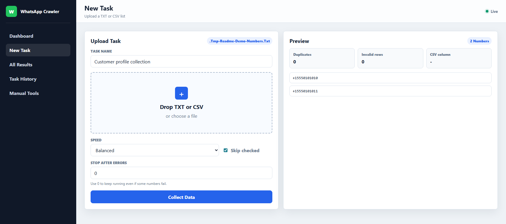

# WhatsApp Profile Crawler

Python web UI for WhatsApp number lookup, profile capture, task tracking, and result export.

The app runs from the browser. Users can drag and drop a `.txt` or `.csv` number list, name the task, choose a speed profile, start collection, and watch live progress. Results are grouped by task.

## Preview



## Stack

- Python
- FastAPI
- Playwright
- SQLite
- Server-Sent Events
- Static HTML/CSS/JavaScript admin UI

## Setup

```powershell
.\scripts\setup.ps1
```

## Run

```powershell
.\scripts\run-dev.ps1
```

Open:

```text
http://localhost:3030
```

The first run opens WhatsApp Web. Scan the QR code in the browser window. The session is saved locally in `sessions/`.

New profile and cover images are saved in one flat `images/profiles/` folder. Task/result ownership is stored in SQLite, so the UI can still show images by task.

## Task Workflow

1. Open the admin panel.
2. Go to New Task.
3. Drop a `.txt` or `.csv` file.
4. Review the detected numbers.
5. Name the task.
6. Click Collect Data.
7. Track progress on the dashboard.
8. Review or export results from Task Results.

## CSV Format

The parser looks for common phone columns:

```text
phone, number, mobile, msisdn, contact, whatsapp
```

If no known column exists, it uses the first column.

## Speed Profiles

- Safe: slower, lower block risk
- Balanced: default
- Fast: shorter delays, higher block risk

WhatsApp can rate-limit or block suspicious automation. Use Safe or Balanced for larger lists.
